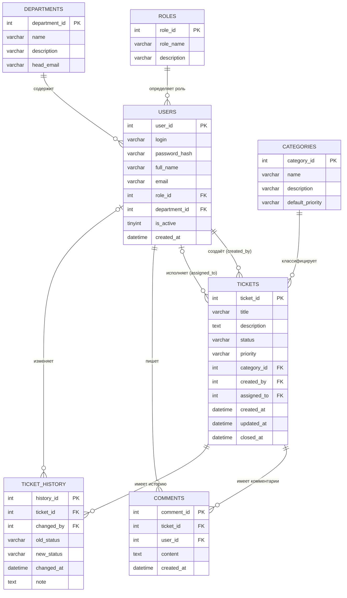

# Этап 1. Проектирование базы данных

## Задание

На данном этапе необходимо:

1. Выбрать предметную область из утверждённого списка (см. раздел «Предметные области»).
2. Обосновать выбор и описать предметную область (3–5 предложений).
3. Построить ER-диаграмму (не менее 5 таблиц).
4. Описать каждую таблицу: поля, типы данных, ключи.
5. Описать связи между таблицами.
6. Написать и выполнить DDL-скрипт `CREATE TABLE` для выбранной СУБД.
7. Внести тестовые данные (`INSERT`) — не менее 2–3 записей в каждую таблицу.
8. Сделать скриншоты: ER-диаграмма, список таблиц в СУБД, результаты SELECT из созданных таблиц.

---

!!! warning "Важно"
    Ниже приведён **пример** выполнения этапа для предметной области «Система управления заявками технической поддержки (Helpdesk)» на стеке **MySQL + C# Windows Forms**. Используйте этот пример как образец оформления. В своём отчёте опишите **собственную** предметную область.

---

## Пример: Helpdesk — система управления заявками

### Описание предметной области

Компания «ТехПоддержка Плюс» предоставляет услуги технической поддержки сотрудникам и клиентам. Основной инструмент работы — система Helpdesk: централизованный журнал заявок, позволяющий регистрировать обращения, назначать исполнителей и отслеживать статус каждой заявки.

Пользователи системы делятся на три категории: **клиенты** (создают заявки), **специалисты поддержки** (принимают и решают заявки) и **администраторы** (управляют справочниками, пользователями и настройками).

### Обоснование выбора

Предметная область выбрана по следующим причинам:

- Содержит богатую логику (смена статусов, назначение исполнителей, история изменений), при которой триггеры и хранимые процедуры органично встраиваются в архитектуру.
- Включает 7 таблиц с разнообразными типами связей (1:N, N:1, ссылки на себя).
- Предметная область не пересекается с проектом ПМ.03 (библиотека / склад / другая тема).
- Может служить основой для дипломного проекта (ВКР).

---

### ER-диаграмма



///caption
Рисунок 1 — ER-диаграмма системы Helpdesk (IE-нотация, 7 таблиц)
///

---

### Описание таблиц

#### Таблица `roles` — Роли пользователей

| Поле | Тип MySQL | Ключ | Описание |
|------|-----------|------|----------|
| `role_id` | `INT AUTO_INCREMENT` | PK | Идентификатор роли |
| `role_name` | `VARCHAR(50)` | UNIQUE | Название роли: `admin`, `support`, `client` |
| `description` | `VARCHAR(255)` | — | Описание роли |

#### Таблица `departments` — Отделы

| Поле | Тип MySQL | Ключ | Описание |
|------|-----------|------|----------|
| `department_id` | `INT AUTO_INCREMENT` | PK | Идентификатор отдела |
| `name` | `VARCHAR(100)` | — | Название отдела |
| `description` | `VARCHAR(255)` | — | Описание деятельности отдела |
| `head_email` | `VARCHAR(150)` | — | Email руководителя отдела |

#### Таблица `users` — Пользователи системы

| Поле | Тип MySQL | Ключ | Описание |
|------|-----------|------|----------|
| `user_id` | `INT AUTO_INCREMENT` | PK | Идентификатор пользователя |
| `login` | `VARCHAR(80)` | UNIQUE | Логин для входа в систему |
| `password_hash` | `VARCHAR(64)` | — | SHA-256 хэш пароля |
| `full_name` | `VARCHAR(150)` | — | Полное имя |
| `email` | `VARCHAR(150)` | UNIQUE | Email |
| `role_id` | `INT` | FK → roles | Роль пользователя |
| `department_id` | `INT` | FK → departments | Принадлежность к отделу |
| `is_active` | `TINYINT(1)` | — | 1 — активен, 0 — заблокирован |
| `created_at` | `DATETIME` | — | Дата и время регистрации |

#### Таблица `categories` — Категории заявок

| Поле | Тип MySQL | Ключ | Описание |
|------|-----------|------|----------|
| `category_id` | `INT AUTO_INCREMENT` | PK | Идентификатор категории |
| `name` | `VARCHAR(100)` | UNIQUE | Название категории |
| `description` | `VARCHAR(255)` | — | Описание |
| `default_priority` | `VARCHAR(20)` | — | Приоритет по умолчанию: `low`, `medium`, `high` |

#### Таблица `tickets` — Заявки

| Поле | Тип MySQL | Ключ | Описание |
|------|-----------|------|----------|
| `ticket_id` | `INT AUTO_INCREMENT` | PK | Идентификатор заявки |
| `title` | `VARCHAR(200)` | — | Краткое описание проблемы |
| `description` | `TEXT` | — | Подробное описание |
| `status` | `VARCHAR(30)` | — | Статус: `new`, `in_progress`, `resolved`, `closed` |
| `priority` | `VARCHAR(20)` | — | Приоритет: `low`, `medium`, `high`, `critical` |
| `category_id` | `INT` | FK → categories | Категория заявки |
| `created_by` | `INT` | FK → users | Автор заявки |
| `assigned_to` | `INT` NULL | FK → users | Назначенный исполнитель |
| `created_at` | `DATETIME` | — | Время создания |
| `updated_at` | `DATETIME` NULL | — | Время последнего обновления |
| `closed_at` | `DATETIME` NULL | — | Время закрытия |

#### Таблица `comments` — Комментарии к заявкам

| Поле | Тип MySQL | Ключ | Описание |
|------|-----------|------|----------|
| `comment_id` | `INT AUTO_INCREMENT` | PK | Идентификатор комментария |
| `ticket_id` | `INT` | FK → tickets (CASCADE) | Заявка |
| `user_id` | `INT` | FK → users | Автор комментария |
| `content` | `TEXT` | — | Текст комментария |
| `created_at` | `DATETIME` | — | Время публикации |

#### Таблица `ticket_history` — История изменений заявок

| Поле | Тип MySQL | Ключ | Описание |
|------|-----------|------|----------|
| `history_id` | `INT AUTO_INCREMENT` | PK | Идентификатор записи |
| `ticket_id` | `INT` | FK → tickets (CASCADE) | Заявка |
| `changed_by` | `INT` NULL | FK → users | Кто изменил (NULL — триггер/система) |
| `old_status` | `VARCHAR(30)` | — | Предыдущий статус |
| `new_status` | `VARCHAR(30)` | — | Новый статус |
| `changed_at` | `DATETIME` | — | Время изменения |
| `note` | `TEXT` | — | Примечание |

---

### Связи между таблицами

| Связь | FK (дочерняя таблица) | → PK (родительская) | Тип | Смысл |
|-------|----------------------|---------------------|-----|-------|
| roles → users | `users.role_id` | `roles.role_id` | 1:N | Пользователь имеет одну роль |
| departments → users | `users.department_id` | `departments.department_id` | 1:N | Пользователь принадлежит отделу |
| users → tickets (автор) | `tickets.created_by` | `users.user_id` | 1:N | Пользователь создаёт заявки |
| users → tickets (исполнитель) | `tickets.assigned_to` | `users.user_id` | 1:N | Специалист назначается на заявки |
| categories → tickets | `tickets.category_id` | `categories.category_id` | 1:N | Заявка принадлежит категории |
| tickets → comments | `comments.ticket_id` | `tickets.ticket_id` | 1:N CASCADE | Заявка имеет комментарии |
| users → comments | `comments.user_id` | `users.user_id` | 1:N | Пользователь пишет комментарии |
| tickets → ticket_history | `ticket_history.ticket_id` | `tickets.ticket_id` | 1:N CASCADE | История принадлежит заявке |

---

### DDL-скрипт CREATE TABLE (MySQL)

```sql
-- ============================================================
-- База данных: helpdesk
-- СУБД: MySQL 8.x, InnoDB, UTF-8
-- ============================================================

CREATE DATABASE IF NOT EXISTS helpdesk
    CHARACTER SET utf8mb4
    COLLATE utf8mb4_unicode_ci;

USE helpdesk;

-- ------------------------------------------------------------
-- Таблица 1: roles
-- ------------------------------------------------------------
CREATE TABLE IF NOT EXISTS roles (
    role_id     INT          NOT NULL AUTO_INCREMENT,
    role_name   VARCHAR(50)  NOT NULL,
    description VARCHAR(255),
    PRIMARY KEY (role_id),
    UNIQUE KEY uq_role_name (role_name)
) ENGINE=InnoDB DEFAULT CHARSET=utf8mb4;

-- ------------------------------------------------------------
-- Таблица 2: departments
-- ------------------------------------------------------------
CREATE TABLE IF NOT EXISTS departments (
    department_id INT          NOT NULL AUTO_INCREMENT,
    name          VARCHAR(100) NOT NULL,
    description   VARCHAR(255),
    head_email    VARCHAR(150),
    PRIMARY KEY (department_id)
) ENGINE=InnoDB DEFAULT CHARSET=utf8mb4;

-- ------------------------------------------------------------
-- Таблица 3: users
-- ------------------------------------------------------------
CREATE TABLE IF NOT EXISTS users (
    user_id       INT          NOT NULL AUTO_INCREMENT,
    login         VARCHAR(80)  NOT NULL,
    password_hash VARCHAR(64)  NOT NULL,
    full_name     VARCHAR(150) NOT NULL,
    email         VARCHAR(150) NOT NULL,
    role_id       INT          NOT NULL,
    department_id INT,
    is_active     TINYINT(1)   NOT NULL DEFAULT 1,
    created_at    DATETIME     NOT NULL DEFAULT NOW(),
    PRIMARY KEY (user_id),
    UNIQUE KEY uq_users_login (login),
    UNIQUE KEY uq_users_email (email),
    CONSTRAINT fk_users_role
        FOREIGN KEY (role_id) REFERENCES roles (role_id)
        ON DELETE RESTRICT ON UPDATE CASCADE,
    CONSTRAINT fk_users_dept
        FOREIGN KEY (department_id) REFERENCES departments (department_id)
        ON DELETE SET NULL ON UPDATE CASCADE
) ENGINE=InnoDB DEFAULT CHARSET=utf8mb4;

-- ------------------------------------------------------------
-- Таблица 4: categories
-- ------------------------------------------------------------
CREATE TABLE IF NOT EXISTS categories (
    category_id      INT          NOT NULL AUTO_INCREMENT,
    name             VARCHAR(100) NOT NULL,
    description      VARCHAR(255),
    default_priority VARCHAR(20)  NOT NULL DEFAULT 'medium',
    PRIMARY KEY (category_id),
    UNIQUE KEY uq_category_name (name)
) ENGINE=InnoDB DEFAULT CHARSET=utf8mb4;

-- ------------------------------------------------------------
-- Таблица 5: tickets
-- ------------------------------------------------------------
CREATE TABLE IF NOT EXISTS tickets (
    ticket_id   INT          NOT NULL AUTO_INCREMENT,
    title       VARCHAR(200) NOT NULL,
    description TEXT,
    status      VARCHAR(30)  NOT NULL DEFAULT 'new',
    priority    VARCHAR(20)  NOT NULL DEFAULT 'medium',
    category_id INT          NOT NULL,
    created_by  INT          NOT NULL,
    assigned_to INT,
    created_at  DATETIME     NOT NULL DEFAULT NOW(),
    updated_at  DATETIME,
    closed_at   DATETIME,
    PRIMARY KEY (ticket_id),
    CONSTRAINT fk_tickets_category
        FOREIGN KEY (category_id) REFERENCES categories (category_id)
        ON DELETE RESTRICT ON UPDATE CASCADE,
    CONSTRAINT fk_tickets_creator
        FOREIGN KEY (created_by) REFERENCES users (user_id)
        ON DELETE RESTRICT ON UPDATE CASCADE,
    CONSTRAINT fk_tickets_assignee
        FOREIGN KEY (assigned_to) REFERENCES users (user_id)
        ON DELETE SET NULL ON UPDATE CASCADE
) ENGINE=InnoDB DEFAULT CHARSET=utf8mb4;

-- ------------------------------------------------------------
-- Таблица 6: comments
-- ------------------------------------------------------------
CREATE TABLE IF NOT EXISTS comments (
    comment_id INT      NOT NULL AUTO_INCREMENT,
    ticket_id  INT      NOT NULL,
    user_id    INT      NOT NULL,
    content    TEXT     NOT NULL,
    created_at DATETIME NOT NULL DEFAULT NOW(),
    PRIMARY KEY (comment_id),
    CONSTRAINT fk_comments_ticket
        FOREIGN KEY (ticket_id) REFERENCES tickets (ticket_id)
        ON DELETE CASCADE ON UPDATE CASCADE,
    CONSTRAINT fk_comments_user
        FOREIGN KEY (user_id) REFERENCES users (user_id)
        ON DELETE RESTRICT ON UPDATE CASCADE
) ENGINE=InnoDB DEFAULT CHARSET=utf8mb4;

-- ------------------------------------------------------------
-- Таблица 7: ticket_history
-- ------------------------------------------------------------
CREATE TABLE IF NOT EXISTS ticket_history (
    history_id INT         NOT NULL AUTO_INCREMENT,
    ticket_id  INT         NOT NULL,
    changed_by INT,
    old_status VARCHAR(30),
    new_status VARCHAR(30) NOT NULL,
    changed_at DATETIME    NOT NULL DEFAULT NOW(),
    note       TEXT,
    PRIMARY KEY (history_id),
    CONSTRAINT fk_history_ticket
        FOREIGN KEY (ticket_id) REFERENCES tickets (ticket_id)
        ON DELETE CASCADE ON UPDATE CASCADE,
    CONSTRAINT fk_history_user
        FOREIGN KEY (changed_by) REFERENCES users (user_id)
        ON DELETE SET NULL ON UPDATE CASCADE
) ENGINE=InnoDB DEFAULT CHARSET=utf8mb4;
```

---

### Тестовые данные (INSERT)

```sql
-- ------------------------------------------------------------
-- Роли
-- ------------------------------------------------------------
INSERT INTO roles (role_name, description) VALUES
    ('admin',   'Администратор системы'),
    ('support', 'Специалист технической поддержки'),
    ('client',  'Пользователь — создаёт заявки');

-- ------------------------------------------------------------
-- Отделы
-- ------------------------------------------------------------
INSERT INTO departments (name, description, head_email) VALUES
    ('ИТ-отдел',          'Отдел информационных технологий',   'it@techplus.ru'),
    ('Отдел продаж',       'Коммерческий отдел компании',       'sales@techplus.ru'),
    ('Бухгалтерия',        'Финансово-бухгалтерский отдел',     'buh@techplus.ru');

-- ------------------------------------------------------------
-- Пользователи (password_hash — SHA2('pass123', 256) для примера)
-- ------------------------------------------------------------
INSERT INTO users (login, password_hash, full_name, email, role_id, department_id, is_active) VALUES
    ('admin',    SHA2('AdminPass123', 256),   'Соколов Андрей Игоревич',   'admin@techplus.ru',   1, 1, 1),
    ('support1', SHA2('SuppPass123', 256),    'Петрова Марина Сергеевна',  'petrov@techplus.ru',  2, 1, 1),
    ('ivanov',   SHA2('IvPass123', 256),      'Иванов Пётр Николаевич',    'ivanov@techplus.ru',  3, 2, 1),
    ('klimova',  SHA2('KlimPass123', 256),    'Климова Анна Дмитриевна',   'klimova@techplus.ru', 3, 3, 1);

-- ------------------------------------------------------------
-- Категории заявок
-- ------------------------------------------------------------
INSERT INTO categories (name, description, default_priority) VALUES
    ('Сетевые проблемы',      'Нет доступа к сети, интернету, VPN',       'high'),
    ('Программное обеспечение','Ошибки, сбои, установка ПО',               'medium'),
    ('Оборудование',           'Неисправность техники, замена комплектующих','high');

-- ------------------------------------------------------------
-- Заявки
-- ------------------------------------------------------------
INSERT INTO tickets (title, description, status, priority, category_id, created_by, assigned_to, created_at) VALUES
    ('Не работает интернет в офисе 205',
     'После перезагрузки роутера интернет не поднялся. Все компьютеры без сети.',
     'new', 'high', 1, 3, NULL, NOW()),

    ('Ошибка при запуске 1С',
     'При открытии 1С:Предприятие выдаёт ошибку "Платформа не найдена".',
     'in_progress', 'medium', 2, 4, 2, NOW()),

    ('Сломался монитор',
     'Монитор не включается, мигает индикатор питания.',
     'new', 'medium', 3, 3, NULL, NOW()),

    ('Нет доступа к корпоративной почте',
     'Outlook не открывается, выдаёт ошибку авторизации.',
     'resolved', 'high', 1, 4, 2, DATE_SUB(NOW(), INTERVAL 2 DAY));

-- ------------------------------------------------------------
-- Комментарии
-- ------------------------------------------------------------
INSERT INTO comments (ticket_id, user_id, content) VALUES
    (2, 2, 'Начал диагностику. Перепроверяю путь к платформе 1С.'),
    (2, 4, 'Хорошо, жду результата.'),
    (4, 2, 'Проблема решена: сбросил пароль учётной записи Exchange.');

-- ------------------------------------------------------------
-- История изменений
-- ------------------------------------------------------------
INSERT INTO ticket_history (ticket_id, changed_by, old_status, new_status, note) VALUES
    (2, 2, 'new',         'in_progress', 'Заявка принята в работу'),
    (4, 2, 'new',         'in_progress', 'Начата диагностика'),
    (4, 2, 'in_progress', 'resolved',    'Сброшен пароль Exchange');
```

---

### Вывод по этапу

На данном этапе спроектирована реляционная база данных системы Helpdesk «ТехПоддержка Плюс», включающая 7 таблиц. Схема нормализована до 3НФ: отсутствует дублирование данных, каждый атрибут функционально зависит от первичного ключа своей таблицы.

Определены связи: `roles → users` (1:N), `departments → users` (1:N), `users → tickets` (1:N, дважды), `categories → tickets` (1:N), `tickets → comments` (1:N CASCADE), `tickets → ticket_history` (1:N CASCADE).

DDL-скрипт успешно выполнен, созданы все 7 таблиц. Внесены тестовые данные: 3 роли, 3 отдела, 4 пользователя, 3 категории, 4 заявки, 3 комментария, 3 записи истории.
