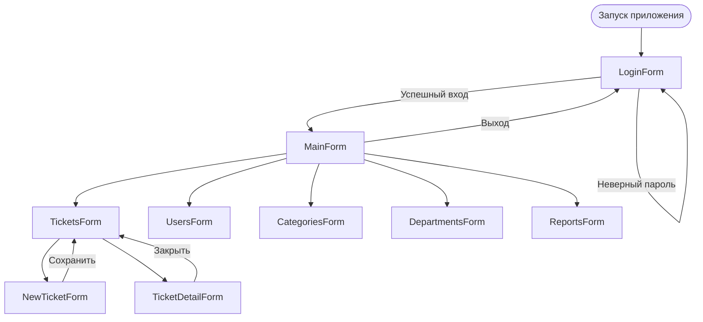

# Этап 4. CRUD и запросы с JOIN

## Задание

На данном этапе необходимо:

1. Написать и выполнить запросы с INNER JOIN, LEFT JOIN, RIGHT JOIN (минимум по одному каждого вида).
2. Продемонстрировать все четыре CRUD-операции через приложение C# WinForms.
3. Реализовать загрузку данных в `DataGridView` через View или SELECT.
4. Реализовать создание, редактирование и удаление записи с параметризованными запросами.
5. Описать архитектуру приложения: список форм и схему навигации.
6. Привести класс `DBConnection` для управления подключением.
7. Сделать скриншоты: результаты каждого типа JOIN, формы приложения с данными.

---

!!! warning "Важно"
    Ниже приведён **пример** выполнения этапа для предметной области «Helpdesk» (MySQL + C# Windows Forms). В своём варианте реализуйте CRUD и JOIN-запросы для **вашей** предметной области.

---

## Пример: CRUD и JOIN для системы Helpdesk

### 1. JOIN-запросы

#### 1.1 INNER JOIN — заявки с именем автора

Возвращает только те заявки, у которых гарантированно указан автор (поле `created_by` ссылается на существующего пользователя).

```sql
SELECT
    t.ticket_id,
    t.title,
    t.status,
    u.full_name AS author
FROM tickets t
JOIN users u ON t.created_by = u.user_id
ORDER BY t.created_at DESC;
```

#### 1.2 INNER JOIN (3 таблицы) — полная информация о заявке

Объединяет заявку с категорией, автором, отделом автора и исполнителем. `LEFT JOIN` применяется для необязательных связей.

```sql
SELECT
    t.ticket_id,
    t.title,
    t.status,
    t.priority,
    c.name          AS category,
    u1.full_name    AS author,
    d.name          AS department,
    u2.full_name    AS assignee
FROM tickets t
JOIN  categories c   ON t.category_id   = c.category_id
JOIN  users u1       ON t.created_by    = u1.user_id
LEFT JOIN departments d  ON u1.department_id = d.department_id
LEFT JOIN users u2   ON t.assigned_to   = u2.user_id
ORDER BY t.created_at DESC;
```

#### 1.3 LEFT JOIN — все отделы, включая пустые (без сотрудников)

```sql
SELECT
    d.name        AS department,
    COUNT(u.user_id) AS staff_count
FROM departments d
LEFT JOIN users u ON d.department_id = u.department_id
GROUP BY d.department_id, d.name
ORDER BY staff_count DESC;
```

#### 1.4 LEFT JOIN — заявки без назначенного исполнителя

Классический паттерн: `LEFT JOIN ... WHERE right_id IS NULL` находит записи без соответствия в правой таблице.

```sql
SELECT
    t.ticket_id,
    t.title,
    t.status,
    t.priority,
    t.created_at
FROM tickets t
LEFT JOIN users u ON t.assigned_to = u.user_id
WHERE u.user_id IS NULL
ORDER BY t.priority DESC, t.created_at ASC;
```

#### 1.5 RIGHT JOIN — все категории, включая те без заявок

```sql
SELECT
    c.name           AS category,
    COUNT(t.ticket_id) AS ticket_count
FROM tickets t
RIGHT JOIN categories c ON t.category_id = c.category_id
GROUP BY c.category_id, c.name
ORDER BY ticket_count DESC;
```

#### 1.6 Агрегат с GROUP BY + HAVING — категории с более чем 2 заявками

```sql
SELECT
    c.name           AS category,
    COUNT(t.ticket_id) AS ticket_count,
    AVG(CASE t.priority
            WHEN 'critical' THEN 4
            WHEN 'high'     THEN 3
            WHEN 'medium'   THEN 2
            WHEN 'low'      THEN 1
            ELSE 2
        END) AS avg_priority_score
FROM categories c
JOIN tickets t ON c.category_id = t.category_id
GROUP BY c.category_id, c.name
HAVING COUNT(t.ticket_id) > 2
ORDER BY ticket_count DESC;
```

---

### 2. CRUD в C# WinForms

#### 2.1 Класс `DBConnection` — управление подключением

```csharp
using MySql.Data.MySqlClient;
using System.Configuration;

/// <summary>
/// Статический класс для получения соединения с MySQL.
/// Строка подключения берётся из App.config.
/// </summary>
public static class DBConnection
{
    private static readonly string _connectionString =
        ConfigurationManager.ConnectionStrings["HelpdeskDB"].ConnectionString;

    /// <summary>
    /// Возвращает новый объект MySqlConnection.
    /// Вызывающий код обязан вызвать conn.Open() и затем Dispose().
    /// </summary>
    public static MySqlConnection GetConnection()
    {
        return new MySqlConnection(_connectionString);
    }
}
```

Строка подключения в `App.config`:

```xml
<connectionStrings>
  <add name="HelpdeskDB"
       connectionString="server=localhost;port=3306;database=helpdesk;
                         user=app_support;password=SuppPass!23;
                         charset=utf8mb4;"
       providerName="MySql.Data.MySqlClient" />
</connectionStrings>
```

#### 2.2 READ — загрузка заявок из VIEW в DataGridView

```csharp
public partial class TicketsForm : Form
{
    private void LoadTickets(string statusFilter = null)
    {
        try
        {
            using var conn = DBConnection.GetConnection();
            conn.Open();

            string sql = @"
                SELECT ticket_id   AS `№`,
                       title       AS `Тема`,
                       status      AS `Статус`,
                       priority    AS `Приоритет`,
                       category    AS `Категория`,
                       author      AS `Автор`,
                       author_dept AS `Отдел`,
                       assignee    AS `Исполнитель`,
                       created_at  AS `Создана`
                FROM v_tickets_full";

            if (!string.IsNullOrEmpty(statusFilter))
                sql += " WHERE status = @status";

            sql += " ORDER BY created_at DESC";

            using var cmd     = new MySqlCommand(sql, conn);
            if (!string.IsNullOrEmpty(statusFilter))
                cmd.Parameters.AddWithValue("@status", statusFilter);

            using var adapter = new MySqlDataAdapter(cmd);
            var table = new DataTable();
            adapter.Fill(table);

            dataGridViewTickets.DataSource = table;

            // Скрыть столбец с ID (он нужен для операций, но не для отображения)
            if (dataGridViewTickets.Columns.Contains("№"))
                dataGridViewTickets.Columns["№"].Visible = false;

            dataGridViewTickets.AutoResizeColumns();
        }
        catch (MySqlException ex)
        {
            MessageBox.Show($"Ошибка загрузки данных: {ex.Message}", "Ошибка",
                            MessageBoxButtons.OK, MessageBoxIcon.Error);
        }
    }
}
```

#### 2.3 CREATE — создание новой заявки

```csharp
public partial class NewTicketForm : Form
{
    private void btnCreate_Click(object sender, EventArgs e)
    {
        string title       = txtTitle.Text.Trim();
        string description = txtDescription.Text.Trim();
        int    categoryId  = Convert.ToInt32(comboBoxCategory.SelectedValue);
        string priority    = comboBoxPriority.SelectedItem?.ToString() ?? "medium";

        if (string.IsNullOrWhiteSpace(title))
        {
            MessageBox.Show("Введите тему заявки.", "Ошибка",
                            MessageBoxButtons.OK, MessageBoxIcon.Warning);
            return;
        }

        try
        {
            using var conn = DBConnection.GetConnection();
            conn.Open();

            const string sql = @"
                INSERT INTO tickets
                    (title, description, status, priority, category_id, created_by, created_at)
                VALUES
                    (@title, @desc, 'new', @priority, @catId, @createdBy, NOW())";

            using var cmd = new MySqlCommand(sql, conn);
            cmd.Parameters.AddWithValue("@title",     title);
            cmd.Parameters.AddWithValue("@desc",      description);
            cmd.Parameters.AddWithValue("@priority",  priority);
            cmd.Parameters.AddWithValue("@catId",     categoryId);
            cmd.Parameters.AddWithValue("@createdBy", AppSession.UserId);

            cmd.ExecuteNonQuery();

            // Получить ID созданной заявки
            long newId = cmd.LastInsertedId;

            MessageBox.Show($"Заявка №{newId} успешно создана.", "Успех",
                            MessageBoxButtons.OK, MessageBoxIcon.Information);
            this.DialogResult = DialogResult.OK;
            this.Close();
        }
        catch (MySqlException ex)
        {
            MessageBox.Show($"Ошибка: {ex.Message}", "Ошибка БД",
                            MessageBoxButtons.OK, MessageBoxIcon.Error);
        }
    }
}
```

#### 2.4 UPDATE — изменение статуса заявки через хранимую процедуру

```csharp
public partial class TicketsForm : Form
{
    private void btnChangeStatus_Click(object sender, EventArgs e)
    {
        if (dataGridViewTickets.SelectedRows.Count == 0)
        {
            MessageBox.Show("Выберите заявку.", "Внимание",
                            MessageBoxButtons.OK, MessageBoxIcon.Warning);
            return;
        }

        // Получить ID из скрытого столбца
        int    ticketId  = Convert.ToInt32(dataGridViewTickets.SelectedRows[0].Cells["№"].Value);
        string newStatus = comboBoxNewStatus.SelectedItem?.ToString();

        if (string.IsNullOrEmpty(newStatus)) return;

        try
        {
            using var conn = DBConnection.GetConnection();
            conn.Open();

            using var cmd = new MySqlCommand("sp_change_ticket_status", conn)
            {
                CommandType = System.Data.CommandType.StoredProcedure
            };
            cmd.Parameters.AddWithValue("p_ticket_id",  ticketId);
            cmd.Parameters.AddWithValue("p_new_status", newStatus);
            cmd.Parameters.AddWithValue("p_user_id",    AppSession.UserId);
            cmd.Parameters.AddWithValue("p_note",       $"Изменено через форму пользователем {AppSession.UserName}");

            cmd.ExecuteNonQuery();

            MessageBox.Show($"Статус заявки №{ticketId} изменён на «{newStatus}».", "Успех",
                            MessageBoxButtons.OK, MessageBoxIcon.Information);
            LoadTickets();
        }
        catch (MySqlException ex)
        {
            MessageBox.Show($"Ошибка: {ex.Message}", "Ошибка БД",
                            MessageBoxButtons.OK, MessageBoxIcon.Error);
        }
    }
}
```

#### 2.5 DELETE — удаление заявки с подтверждением

```csharp
private void btnDelete_Click(object sender, EventArgs e)
{
    if (dataGridViewTickets.SelectedRows.Count == 0) return;

    int    ticketId = Convert.ToInt32(dataGridViewTickets.SelectedRows[0].Cells["№"].Value);
    string title    = dataGridViewTickets.SelectedRows[0].Cells["Тема"].Value?.ToString();

    var confirm = MessageBox.Show(
        $"Удалить заявку №{ticketId} «{title}»?\n\nВместе с ней будут удалены все комментарии и история.",
        "Подтверждение удаления",
        MessageBoxButtons.YesNo,
        MessageBoxIcon.Warning);

    if (confirm != DialogResult.Yes) return;

    try
    {
        using var conn = DBConnection.GetConnection();
        conn.Open();

        // Благодаря ON DELETE CASCADE удалятся comments и ticket_history автоматически
        const string sql = "DELETE FROM tickets WHERE ticket_id = @id";
        using var cmd = new MySqlCommand(sql, conn);
        cmd.Parameters.AddWithValue("@id", ticketId);
        cmd.ExecuteNonQuery();

        MessageBox.Show($"Заявка №{ticketId} удалена.", "Удалено",
                        MessageBoxButtons.OK, MessageBoxIcon.Information);
        LoadTickets();
    }
    catch (MySqlException ex)
    {
        MessageBox.Show($"Ошибка при удалении: {ex.Message}", "Ошибка БД",
                        MessageBoxButtons.OK, MessageBoxIcon.Error);
    }
}
```

---

### 3. Архитектура приложения C# WinForms

#### 3.1 Структура проекта

Приложение реализовано как один проект C# WinForms (.NET). Формы организованы по принципу «одна форма — одна функциональная область».

| Форма | Назначение |
|-------|-----------|
| `LoginForm` | Авторизация пользователя |
| `MainForm` | Главное окно (MDI-контейнер или форма с вкладками); меню навигации |
| `TicketsForm` | Список заявок, фильтры, управление статусами |
| `NewTicketForm` | Создание новой заявки |
| `TicketDetailForm` | Просмотр заявки, комментарии, история изменений |
| `UsersForm` | Управление пользователями (только для Admin) |
| `CategoriesForm` | Управление категориями |
| `DepartmentsForm` | Управление отделами |
| `ReportsForm` | Статистика: `v_support_stats`, агрегирующие запросы |

#### 3.2 Схема навигации



///caption
Рисунок 1 — Схема навигации между формами приложения Helpdesk
///

#### 3.3 Управление доступом на уровне интерфейса

После входа в систему `AppSession.RoleName` определяет видимость элементов интерфейса.

```csharp
public partial class MainForm : Form
{
    private void ApplyRolePermissions()
    {
        bool isAdmin   = AppSession.RoleName == "admin";
        bool isSupport = AppSession.RoleName == "support" || isAdmin;

        // Управление пользователями — только администратор
        menuItemUsers.Visible       = isAdmin;
        menuItemDepartments.Visible = isAdmin;

        // Назначение исполнителей — поддержка и администратор
        btnAssignTicket.Visible = isSupport;
        btnChangeStatus.Visible = isSupport;

        // Отображение имени пользователя в заголовке
        this.Text = $"Helpdesk — {AppSession.UserName} [{AppSession.RoleName}]";
    }
}
```

#### 3.4 Загрузка справочников (ComboBox)

```csharp
/// <summary>
/// Универсальный метод загрузки справочника в ComboBox.
/// </summary>
private void LoadComboBox(ComboBox comboBox, string query,
                           string valueMember, string displayMember)
{
    using var conn = DBConnection.GetConnection();
    conn.Open();
    using var adapter = new MySqlDataAdapter(query, conn);
    var table = new DataTable();
    adapter.Fill(table);

    comboBox.DataSource    = table;
    comboBox.ValueMember   = valueMember;
    comboBox.DisplayMember = displayMember;
}

// Использование в форме:
private void NewTicketForm_Load(object sender, EventArgs e)
{
    LoadComboBox(comboBoxCategory,
        "SELECT category_id, name FROM categories ORDER BY name",
        "category_id", "name");

    LoadComboBox(comboBoxPriority_dummy, null, null, null); // заполняется вручную
    comboBoxPriority.Items.AddRange(new[] { "low", "medium", "high", "critical" });
    comboBoxPriority.SelectedIndex = 1; // medium по умолчанию
}
```

---

### Вывод по этапу

На данном этапе реализованы все четыре CRUD-операции для таблицы `tickets` в C# WinForms:

- **READ** — загрузка из VIEW `v_tickets_full` в `DataGridView` с фильтрацией по статусу;
- **CREATE** — параметризованный `INSERT` с получением `LastInsertedId`;
- **UPDATE** — вызов хранимой процедуры `sp_change_ticket_status` через `CommandType.StoredProcedure`;
- **DELETE** — параметризованный `DELETE` с каскадным удалением через `ON DELETE CASCADE`.

Выполнены пять видов JOIN-запросов: `INNER JOIN` (с 2 и 5 таблицами), `LEFT JOIN` (агрегат и поиск «записей без пары»), `RIGHT JOIN` (все категории включая пустые).

Описана архитектура приложения: 9 форм, схема навигации, управление видимостью UI-элементов на основе роли пользователя.
