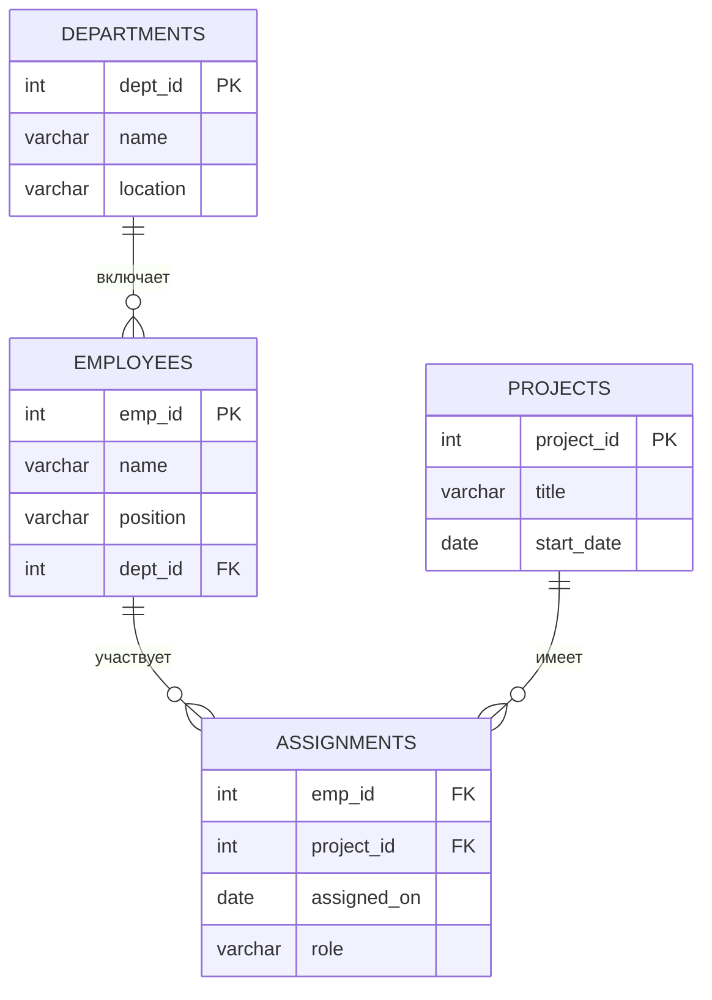
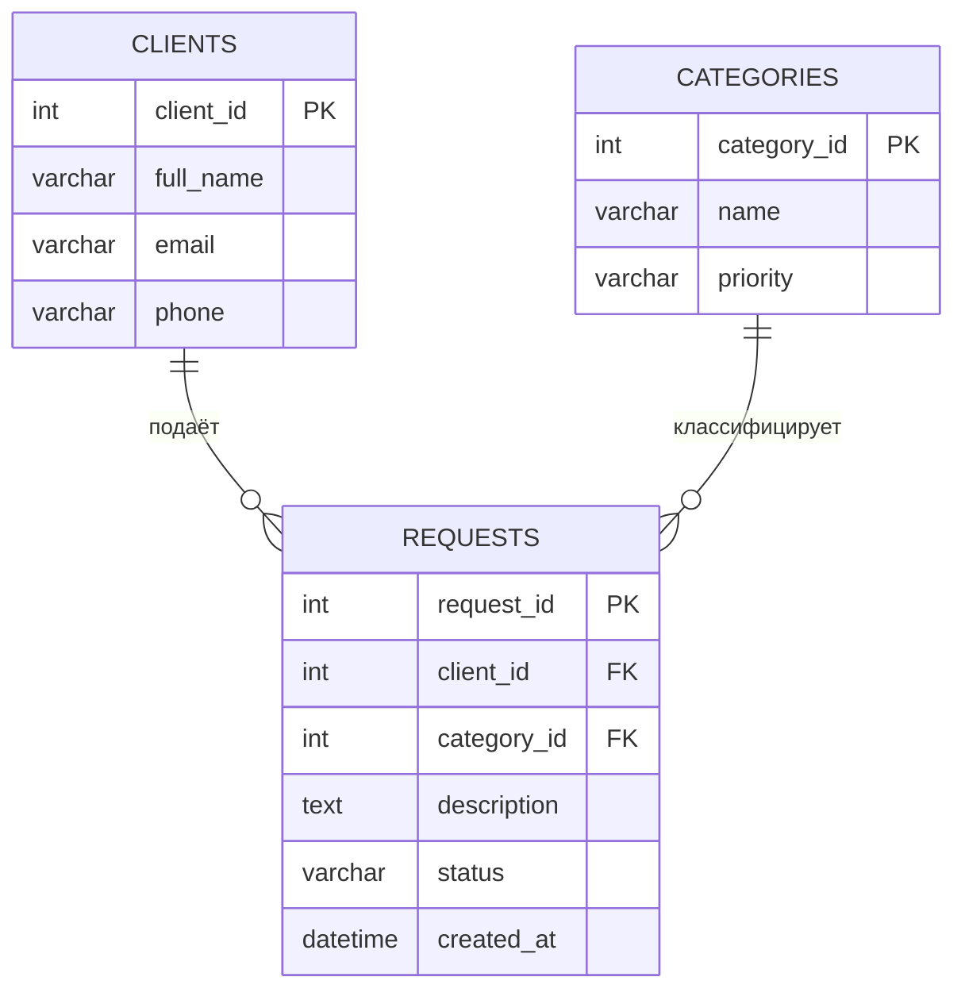

# Этап 1. Проектирование базы данных

## 1. Реляционная модель данных

Реляционная база данных — это совокупность данных, организованных в виде таблиц (отношений), связанных между собой по ключевым полям. Модель предложена Эдгаром Коддом в 1970 году и по сей день является основой большинства промышленных СУБД: MySQL, PostgreSQL, MS SQL Server, Oracle.

Каждая таблица в реляционной БД:

- имеет уникальное имя в пределах базы данных;
- состоит из строк (записей, кортежей) и столбцов (атрибутов, полей);
- каждый столбец хранит данные только одного типа;
- порядок строк и столбцов не имеет семантического значения;
- каждая строка уникально идентифицируется первичным ключом.

---

## 2. Нормализация базы данных

Нормализация — это процесс организации данных в таблицах с целью устранения избыточности и предотвращения аномалий при вставке, обновлении и удалении данных. Нормализация выполняется поэтапно по нормальным формам.

### 2.1 Первая нормальная форма (1НФ)

Таблица находится в 1НФ, если:

- все значения атомарны (неделимы);
- каждая ячейка содержит ровно одно значение;
- каждый столбец имеет уникальное имя;
- в каждой строке хранятся данные только об одном объекте.

**Нарушение 1НФ** — хранение нескольких телефонов в одном поле:

| order_id | client | phones |
|----------|--------|--------|
| 1 | Иванов | +7-900-111, +7-900-222 |

**Исправление:** выделить телефоны в отдельную таблицу `client_phones`.

### 2.2 Вторая нормальная форма (2НФ)

Таблица находится в 2НФ, если она находится в 1НФ и каждый неключевой атрибут **полностью функционально зависит** от первичного ключа (актуально для составных ключей).

**Нарушение 2НФ** — таблица с составным ключом `(order_id, product_id)`, где `product_name` зависит только от `product_id`:

| order_id | product_id | product_name | quantity |
|----------|------------|--------------|----------|
| 1 | 10 | Клавиатура | 2 |
| 2 | 10 | Клавиатура | 1 |

`product_name` зависит только от `product_id`, а не от пары `(order_id, product_id)` — это частичная зависимость.

**Исправление:** вынести `product_name` в отдельную таблицу `products`.

### 2.3 Третья нормальная форма (3НФ)

Таблица находится в 3НФ, если она находится в 2НФ и отсутствуют **транзитивные зависимости** неключевых атрибутов от первичного ключа.

**Нарушение 3НФ** — атрибут `city` зависит от `zip_code`, а `zip_code` зависит от `user_id`:

| user_id | name | zip_code | city |
|---------|------|----------|------|
| 1 | Иванов | 141700 | Долгопрудный |
| 2 | Петров | 141700 | Долгопрудный |

`city` транзитивно зависит от `user_id` через `zip_code`.

**Исправление:** вынести `zip_code → city` в отдельную таблицу `zip_codes`.

!!! info "Практический совет"
    В большинстве учебных и производственных проектов достаточно привести схему к 3НФ. Более высокие нормальные формы (BCNF, 4НФ, 5НФ) применяются в специализированных случаях.

---

## 3. Типы связей между таблицами

### 3.1 Один к одному (1:1)

Каждой записи в таблице A соответствует не более одной записи в таблице B, и наоборот. Используется редко — обычно для разделения редко используемых полей (например, основная информация о сотруднике и расширенный профиль).

| employees | employee_profiles |
|-----------|-------------------|
| employee_id (PK) | profile_id (PK, FK → employees) |
| name | bio |
| position | photo_url |

### 3.2 Один ко многим (1:N)

Наиболее распространённый тип связи. Одной записи в таблице A соответствует множество записей в таблице B. Внешний ключ хранится на стороне "многих".

**Пример:** один отдел → много сотрудников.

| departments | employees |
|-------------|-----------|
| dept_id (PK) | emp_id (PK) |
| dept_name | emp_name |
| | dept_id (FK → departments) |

### 3.3 Многие ко многим (N:M)

Одной записи таблицы A соответствует множество записей таблицы B и наоборот. В реляционной модели такая связь **не может быть реализована напрямую** — она разрешается введением промежуточной (связующей, junction) таблицы.

**Пример:** студенты и курсы — один студент посещает несколько курсов, один курс посещается несколькими студентами.

Без промежуточной таблицы:

| students | courses |
|----------|---------|
| student_id (PK) | course_id (PK) |
| name | title |

С промежуточной таблицей `enrollments`:

| enrollments |
|-------------|
| student_id (FK → students) |
| course_id (FK → courses) |
| enrolled_at |
| grade |

Первичный ключ промежуточной таблицы — составной: `(student_id, course_id)`.

---

## 4. ER-диаграммы

ER-диаграмма (Entity-Relationship Diagram, диаграмма «сущность–связь») — графический инструмент моделирования данных, введённый Питером Ченом в 1976 году.

### 4.1 Основные элементы нотации

| Элемент | Описание |
|---------|----------|
| Сущность (Entity) | Прямоугольник — объект реального мира, о котором хранятся данные |
| Атрибут (Attribute) | Овал (классическая нотация) или список внутри прямоугольника (IE/Crow's Foot) |
| Связь (Relationship) | Ромб (классическая нотация) или линия между таблицами (IE-нотация) |
| Первичный ключ | Подчёркивание атрибута (классическая) или маркер PK |
| Внешний ключ | Маркер FK, стрелка к PK родительской таблицы |

### 4.2 Нотация "Вороньей лапки" (Crow's Foot / IE-нотация)

Современные инструменты (MySQL Workbench, dbdiagram.io, Mermaid) используют IE-нотацию:

| Символ на конце линии | Смысл |
|-----------------------|-------|
| `||` | Ровно один |
| `|o` | Ноль или один |
| `}|` или `>|` | Один или много |
| `}o` или `>o` | Ноль или много |

### 4.3 Пример ER-диаграммы (Mermaid)



///caption
Рисунок 1 — ER-диаграмма: отделы, сотрудники, проекты (IE-нотация, Mermaid)
///

---

## 5. Первичные и внешние ключи

### 5.1 Первичный ключ (PRIMARY KEY)

Первичный ключ — атрибут (или группа атрибутов), однозначно идентифицирующий каждую строку таблицы.

Требования к первичному ключу:

- уникальность: не может быть двух строк с одинаковым значением PK;
- ненулевость: значение PK не может быть NULL;
- неизменность: желательно не изменять значение PK после создания строки;
- минимальность: составной PK не должен содержать лишних атрибутов.

На практике чаще всего используют **суррогатный ключ** — целочисленный автоинкрементный идентификатор, не имеющий смысла в предметной области.

### 5.2 Внешний ключ (FOREIGN KEY)

Внешний ключ — атрибут в дочерней таблице, ссылающийся на первичный ключ родительской таблицы. FK обеспечивает **ссылочную целостность**: СУБД не позволит вставить значение FK, которого нет в PK родительской таблицы.

**Действия при удалении/обновлении родительской записи (`ON DELETE` / `ON UPDATE`):**

| Действие | Поведение |
|----------|-----------|
| `RESTRICT` | Запрещает удаление/обновление, если есть дочерние записи |
| `CASCADE` | Каскадно удаляет/обновляет дочерние записи |
| `SET NULL` | Устанавливает FK в NULL у дочерних записей |
| `NO ACTION` | Аналогично RESTRICT (проверяется в конце транзакции) |
| `SET DEFAULT` | Устанавливает значение по умолчанию (поддерживается не всеми СУБД) |

---

## 6. Индексы

Индекс — вспомогательная структура данных, ускоряющая поиск строк по значению столбца. Работает по принципу предметного указателя книги: вместо перебора всех строк СУБД обращается к индексу и получает адрес нужной строки.

### 6.1 Виды индексов

| Вид | Описание |
|-----|----------|
| PRIMARY (кластерный) | Создаётся автоматически для PRIMARY KEY; строки физически упорядочены по нему (InnoDB) |
| UNIQUE | Гарантирует уникальность значений столбца; ускоряет поиск |
| INDEX (не уникальный) | Ускоряет поиск, не гарантирует уникальность |
| FULLTEXT | Полнотекстовый поиск по TEXT/VARCHAR столбцам |
| COMPOSITE | Индекс по нескольким столбцам одновременно |

### 6.2 Когда создавать индексы

Индексы рекомендуется создавать:

- на столбцах, используемых в `WHERE` фильтрах часто выполняемых запросов;
- на столбцах внешних ключей (JOIN-операции);
- на столбцах, используемых в `ORDER BY` и `GROUP BY`;
- на столбцах с высокой кардинальностью (много уникальных значений).

Индексы **замедляют** операции `INSERT`, `UPDATE`, `DELETE`, так как СУБД должна обновлять индексную структуру. Поэтому не стоит создавать индексы на всех столбцах подряд.

---

## 7. Проектирование схемы данных: от требований к таблицам

Процесс проектирования БД включает следующие этапы:

**Шаг 1. Анализ предметной области.** Изучить бизнес-требования, выявить объекты (сущности), их свойства (атрибуты) и взаимодействия (связи).

**Шаг 2. Концептуальная модель.** Построить ER-диаграмму — независимо от конкретной СУБД. Определить сущности, атрибуты, типы связей.

**Шаг 3. Логическая модель.** Преобразовать ER-диаграмму в набор таблиц с учётом нормализации. Определить первичные и внешние ключи. Разрешить связи N:M через промежуточные таблицы.

**Шаг 4. Физическая модель.** Выбрать конкретные типы данных для каждого столбца с учётом используемой СУБД. Определить ограничения (`NOT NULL`, `UNIQUE`, `DEFAULT`, `CHECK`). Создать индексы.

**Шаг 5. DDL-скрипт.** Написать и выполнить скрипт `CREATE TABLE` для выбранной СУБД.

---

## 8. Сравнение типов данных в MySQL, PostgreSQL и MS SQL Server

Правильный выбор типа данных влияет на объём хранилища, производительность запросов и корректность обработки данных.

### 8.1 Целочисленные типы

| Назначение | MySQL | PostgreSQL | MS SQL Server |
|------------|-------|------------|---------------|
| Небольшое целое | `TINYINT` (1 байт) | `SMALLINT` (2 байта) | `TINYINT` (1 байт) |
| Стандартное целое | `INT` (4 байта) | `INTEGER` / `INT` | `INT` (4 байта) |
| Большое целое | `BIGINT` (8 байт) | `BIGINT` | `BIGINT` |
| Автоинкремент | `INT AUTO_INCREMENT` | `SERIAL` / `GENERATED ALWAYS AS IDENTITY` | `INT IDENTITY(1,1)` |

### 8.2 Строковые типы

| Назначение | MySQL | PostgreSQL | MS SQL Server |
|------------|-------|------------|---------------|
| Короткая строка фиксированной длины | `CHAR(n)` | `CHAR(n)` | `CHAR(n)` / `NCHAR(n)` |
| Строка переменной длины | `VARCHAR(n)` | `VARCHAR(n)` | `VARCHAR(n)` / `NVARCHAR(n)` |
| Длинный текст | `TEXT` / `MEDIUMTEXT` / `LONGTEXT` | `TEXT` (без ограничения) | `VARCHAR(MAX)` / `NVARCHAR(MAX)` |

!!! note "Unicode в MS SQL"
    В MS SQL Server для хранения Unicode (кириллицы, иероглифов и т.д.) используйте типы `NCHAR`, `NVARCHAR`, `NVARCHAR(MAX)` — они хранят символы в кодировке UTF-16. Обычные `VARCHAR` хранят данные в кодировке сервера.

### 8.3 Числа с дробной частью

| Назначение | MySQL | PostgreSQL | MS SQL Server |
|------------|-------|------------|---------------|
| Точная дробная (деньги) | `DECIMAL(p,s)` / `NUMERIC(p,s)` | `NUMERIC(p,s)` | `DECIMAL(p,s)` / `MONEY` |
| Приближённая дробная | `FLOAT` / `DOUBLE` | `REAL` / `DOUBLE PRECISION` | `FLOAT` / `REAL` |

### 8.4 Дата и время

| Назначение | MySQL | PostgreSQL | MS SQL Server |
|------------|-------|------------|---------------|
| Только дата | `DATE` | `DATE` | `DATE` |
| Только время | `TIME` | `TIME` | `TIME` |
| Дата и время | `DATETIME` | `TIMESTAMP` | `DATETIME` / `DATETIME2` |
| С часовым поясом | `DATETIME` (без TZ) | `TIMESTAMPTZ` | `DATETIMEOFFSET` |
| Текущее время | `NOW()` / `CURRENT_TIMESTAMP` | `NOW()` / `CURRENT_TIMESTAMP` | `GETDATE()` / `SYSDATETIME()` |

!!! warning "DATETIME vs TIMESTAMP в MySQL"
    В MySQL `DATETIME` хранит значение без учёта часового пояса (диапазон 1000–9999 г.), а `TIMESTAMP` автоматически конвертирует в UTC при хранении и обратно при чтении (диапазон 1970–2038 г.). Для новых проектов рекомендуется использовать `DATETIME`.

### 8.5 Логический тип

| СУБД | Тип | Значения |
|------|-----|----------|
| MySQL | `TINYINT(1)` или `BOOLEAN` (псевдоним) | 0 / 1 |
| PostgreSQL | `BOOLEAN` | `TRUE` / `FALSE` / `NULL` |
| MS SQL Server | `BIT` | 0 / 1 / NULL |

### 8.6 Прочие типы

| Назначение | MySQL | PostgreSQL | MS SQL Server |
|------------|-------|------------|---------------|
| UUID / GUID | `CHAR(36)` или `BINARY(16)` | `UUID` | `UNIQUEIDENTIFIER` |
| JSON | `JSON` (с MySQL 5.7) | `JSON` / `JSONB` | `NVARCHAR(MAX)` + `ISJSON()` / `JSON` (с 2016) |
| Бинарные данные | `BLOB` / `LONGBLOB` | `BYTEA` | `VARBINARY(MAX)` |
| Перечисление | `ENUM('val1','val2')` | Тип-перечисление (`CREATE TYPE`) | `VARCHAR` + `CHECK` |

---

## 9. DDL-примеры: создание таблиц в трёх СУБД

Рассмотрим типичные таблицы для системы управления заказами и покажем синтаксис для каждой СУБД.

### 9.1 Таблица `orders`

!!! example "MySQL"
    ```sql
    CREATE TABLE orders (
        order_id    INT           NOT NULL AUTO_INCREMENT,
        client_id   INT           NOT NULL,
        order_date  DATETIME      NOT NULL DEFAULT NOW(),
        total       DECIMAL(10,2) NOT NULL DEFAULT 0.00,
        status      VARCHAR(30)   NOT NULL DEFAULT 'new',
        note        TEXT,
        PRIMARY KEY (order_id),
        CONSTRAINT fk_order_client FOREIGN KEY (client_id)
            REFERENCES clients (client_id)
            ON DELETE RESTRICT
            ON UPDATE CASCADE
    ) ENGINE=InnoDB DEFAULT CHARSET=utf8mb4;
    ```

!!! example "PostgreSQL"
    ```sql
    CREATE TABLE orders (
        order_id    SERIAL         NOT NULL,
        client_id   INTEGER        NOT NULL,
        order_date  TIMESTAMPTZ    NOT NULL DEFAULT NOW(),
        total       NUMERIC(10,2)  NOT NULL DEFAULT 0.00,
        status      VARCHAR(30)    NOT NULL DEFAULT 'new',
        note        TEXT,
        PRIMARY KEY (order_id),
        CONSTRAINT fk_order_client FOREIGN KEY (client_id)
            REFERENCES clients (client_id)
            ON DELETE RESTRICT
            ON UPDATE CASCADE
    );
    ```

!!! example "MS SQL Server"
    ```sql
    CREATE TABLE orders (
        order_id    INT             NOT NULL IDENTITY(1,1),
        client_id   INT             NOT NULL,
        order_date  DATETIME2       NOT NULL DEFAULT SYSDATETIME(),
        total       DECIMAL(10,2)   NOT NULL DEFAULT 0.00,
        status      NVARCHAR(30)    NOT NULL DEFAULT N'new',
        note        NVARCHAR(MAX),
        PRIMARY KEY (order_id),
        CONSTRAINT fk_order_client FOREIGN KEY (client_id)
            REFERENCES clients (client_id)
            ON DELETE NO ACTION
            ON UPDATE CASCADE
    );
    ```

### 9.2 Таблица `clients`

!!! example "MySQL"
    ```sql
    CREATE TABLE clients (
        client_id   INT          NOT NULL AUTO_INCREMENT,
        full_name   VARCHAR(150) NOT NULL,
        email       VARCHAR(150) NOT NULL,
        phone       VARCHAR(20),
        created_at  DATETIME     NOT NULL DEFAULT NOW(),
        is_active   TINYINT(1)   NOT NULL DEFAULT 1,
        PRIMARY KEY (client_id),
        UNIQUE KEY uq_client_email (email)
    ) ENGINE=InnoDB DEFAULT CHARSET=utf8mb4;
    ```

!!! example "PostgreSQL"
    ```sql
    CREATE TABLE clients (
        client_id   SERIAL       NOT NULL,
        full_name   VARCHAR(150) NOT NULL,
        email       VARCHAR(150) NOT NULL,
        phone       VARCHAR(20),
        created_at  TIMESTAMPTZ  NOT NULL DEFAULT NOW(),
        is_active   BOOLEAN      NOT NULL DEFAULT TRUE,
        PRIMARY KEY (client_id),
        UNIQUE (email)
    );
    ```

!!! example "MS SQL Server"
    ```sql
    CREATE TABLE clients (
        client_id   INT             NOT NULL IDENTITY(1,1),
        full_name   NVARCHAR(150)   NOT NULL,
        email       NVARCHAR(150)   NOT NULL,
        phone       NVARCHAR(20),
        created_at  DATETIME2       NOT NULL DEFAULT SYSDATETIME(),
        is_active   BIT             NOT NULL DEFAULT 1,
        PRIMARY KEY (client_id),
        UNIQUE (email)
    );
    ```

### 9.3 Создание индексов

!!! example "MySQL"
    ```sql
    -- Индекс на внешний ключ (ускоряет JOIN)
    CREATE INDEX idx_orders_client ON orders (client_id);

    -- Составной индекс (фильтрация по статусу и дате)
    CREATE INDEX idx_orders_status_date ON orders (status, order_date);
    ```

!!! example "PostgreSQL"
    ```sql
    CREATE INDEX idx_orders_client ON orders (client_id);
    CREATE INDEX idx_orders_status_date ON orders (status, order_date);

    -- Частичный индекс: только активные заказы
    CREATE INDEX idx_orders_active ON orders (order_date)
    WHERE status NOT IN ('completed', 'cancelled');
    ```

!!! example "MS SQL Server"
    ```sql
    CREATE INDEX idx_orders_client ON orders (client_id);
    CREATE INDEX idx_orders_status_date ON orders (status, order_date);

    -- Фильтрованный индекс
    CREATE INDEX idx_orders_active ON orders (order_date)
    WHERE status NOT IN ('completed', 'cancelled');
    ```

---

## 10. Полный пример схемы: три таблицы с нормализацией

Приведём пример небольшой схемы из трёх таблиц для системы учёта обращений. Схема полностью нормализована до 3НФ.



///caption
Рисунок 2 — Упрощённая ER-диаграмма системы учёта обращений (3 таблицы)
///

Схема удовлетворяет требованиям 3НФ:

- каждый атрибут атомарен (1НФ);
- нет частичных зависимостей от составного ключа (2НФ, ключи простые);
- нет транзитивных зависимостей: `priority` хранится в `categories`, а не в `requests` (иначе возникла бы транзитивность через `category_id`).

---

## 11. Итоги

Проектирование базы данных — фундаментальный этап разработки информационной системы. Грамотная схема данных:

- обеспечивает целостность и непротиворечивость данных;
- снижает избыточность хранения;
- упрощает написание запросов и снижает вероятность ошибок;
- облегчает расширение системы в будущем.

При проектировании следует руководствоваться принципами нормализации (1НФ–3НФ), правильно выбирать типы связей и типы данных, а также документировать схему с помощью ER-диаграмм.
